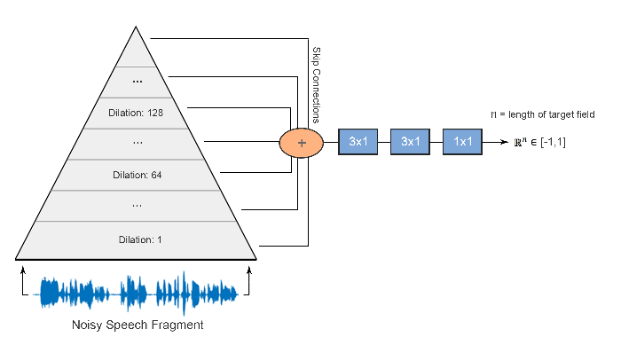

# Introduction

Our task was to reduce noise from speech using deep learning.  

The goal was to preserve sound quality as much as we can, while reducing the noise.  

# Motivation

Cool noise reducing hardware.

{ width=20% }

But this is hardware, and we are computer scientists, not electrical engineers.  

# Motivation

Noise cancelling software.

{ width=30% }

If sound is above the treshold, it goes through.  
Else it is cancelled.  

Not flexible enough.  
Deep learning could do a better job.

# Data pipeline

Training phase.

{ width=60% }
 
We do this on the noisy and clean data as well.  
Input: Noisy slices  
Output: Clean slices  

Data augmentation: Overlapping slices  

# Full data pipeline

{ width=60% }  

Model is a black box now, it will be elaborated later.  

# Tortor posuere ac ut consequat:

1. Eu augue ut lectus arcu bibendum at varius.
2. Nisl suscipit adipiscing bibendum est ultricies integer quis.
3. Facilisi etiam dignissim diam quis enim lobortis scelerisque.
4. **Facilisis mauris sit amet massa vitae tortor condimentum.**

# Maths

Inline $sin^{2}(x)$ maths.  
Display maths:  
$$ \frac{\frac{1}{x}+\frac{1}{y}}{y-z} $$

# Wavenet

{ width=80% }

# Thank you for your attention

Sources:
 
- Dario Rethage, Jordi Pons, and Xavier Serra. “A Wavenet for Speech Denoising”. In: (2018). [arXiv:1706.07162](https://arxiv.org/abs/1706.07162)
- ...
