# Introduction

Our task was to reduce noise from speech using deep learning.  

Preserve sound quality.

# Motivation

Cool noise reducing hardware.

{ width=20% }

But this is hardware, and we are computer scientists, not electrical engineers.  

# Motivation

Noise cancelling software.

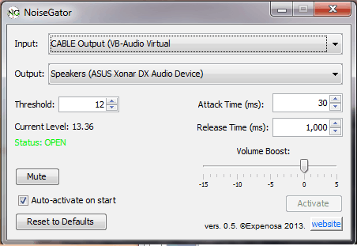{ width=30% }

If sound is above the treshold, it goes through.  
Else it is cancelled.  

Not flexible enough.  
Deep learning could do a better job.

# Existing implementations
 - Autoencoder based
 - GAN based
 - WaveNet based

# Autoencoder based
 - Denoising Autoencoder
 
 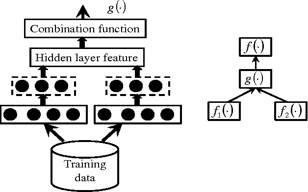{ width=60% }
 
# Autoencoder based
 - Denoising Autoencoder with Multi-branched Encoders
 
  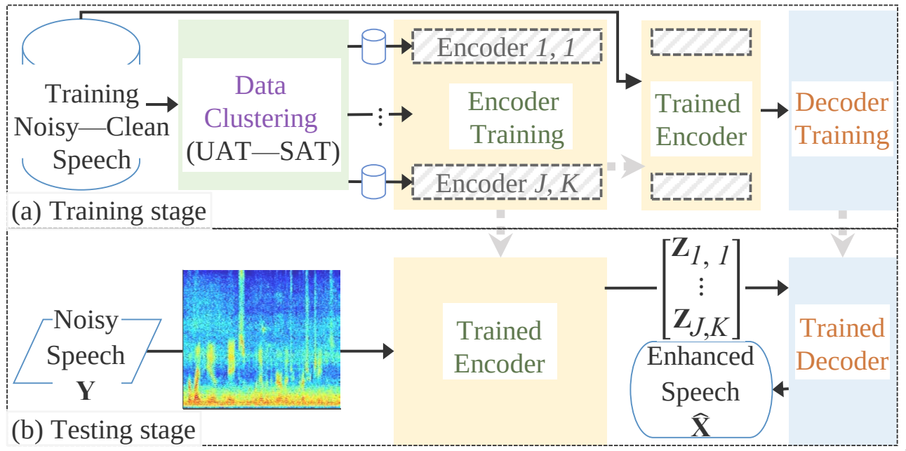{ width=60% }

# GAN based
 - Speech Enhancement Generative Adversarial Network
 
  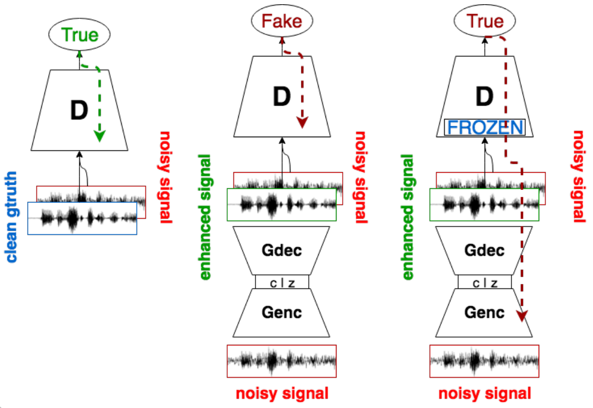{ width=60% }

# WaveNet based
 - Wavenet for Speech Denoising
 
  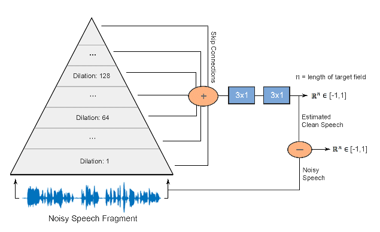{ width=60% }

# Training and testing data
 - ~23000 samples
 - 56 different voices and noise conditions

  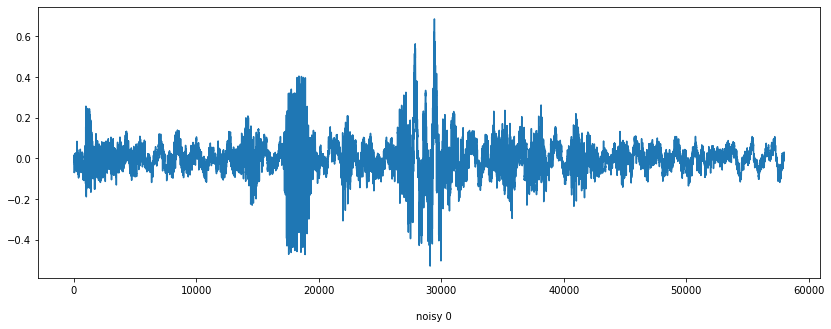{ width=40% }
 
  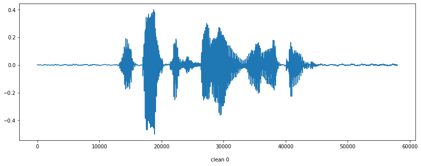{ width=40% }

# Data pipeline

Training phase.

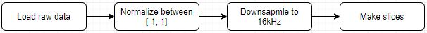{ width=60% }
 
We do this on the noisy and clean data as well.  
Input: Noisy slices  
Output: Clean slices  

Data augmentation: Overlapping slices  

# Full data pipeline

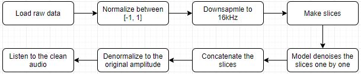{ width=60% }  

Model is a black box now, it will be elaborated later.  

# Original WaveNet

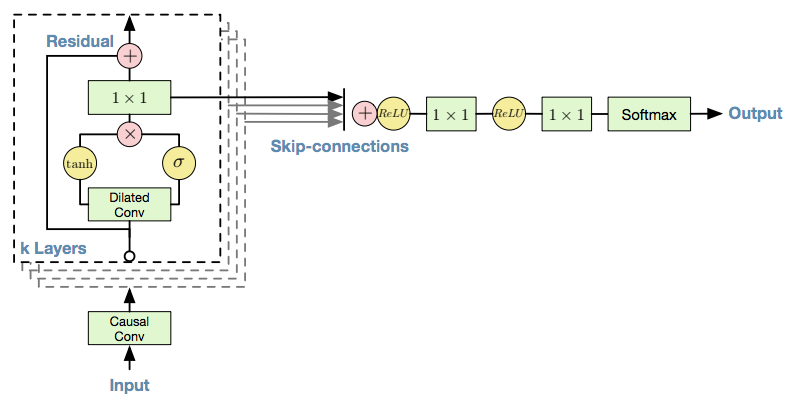{ width=80% }  

Causal convolutions, mu-law transform and softmax distribution.

# Modified wavenet

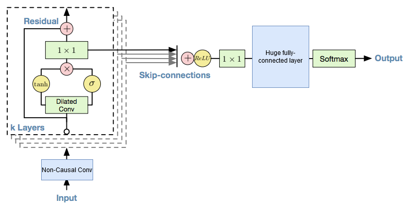{ width=80% }  

Non-causal convolutions, and dense output layer.

# Regression with dense layer

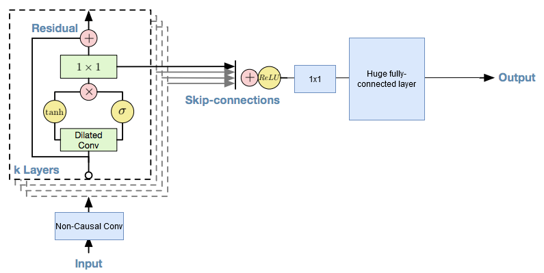{ width=80% }  

WaveNet with non-causal convolutions, regression, and flatten + dense output layers

# WaveNet based autoencoder

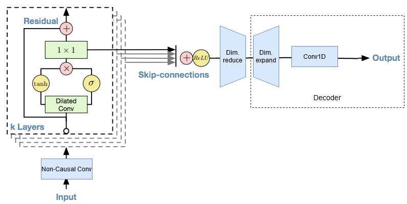{ width=80% } 

# Autoencoder surrounded by WaveNets

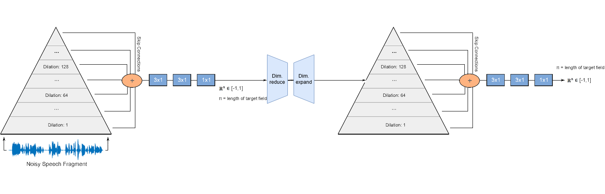{ width=100% } 

# Regression with convolutional layers
 
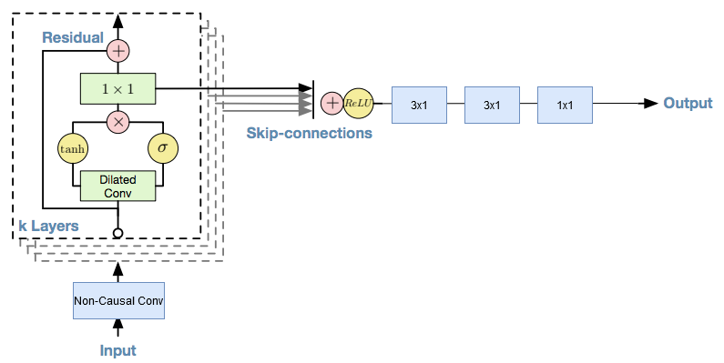{ width=80% }  

WaveNet with non-causal convolutions, regression, and extra one dimensional convolutional layers on the output.

# Training

- Google Cloud Platform
- Clean & Noisy slice generator
- MAE loss
- SGD optimizer
- ReduceLROnPlateau

# Demo

Separately, in an .ipynb

# Summary

Success, but...

# Thank you for your attention

Sources:

\small {
\begin{itemize}
\item Aaron van den Oord, Sander Dieleman, Heiga Zen, Karen Simonyan, Oriol Vinyals, Alex Graves, Nal Kalchbrenner, Andrew Senior, and Koray Kavukcuoglu. “WaveNet: A GenerativeModel for Raw Audio”. In: (2016) \href{https://arxiv.org/abs/1609.03499}{[arXiv:1609.03499]}
\item Dario Rethage, Jordi Pons, and Xavier Serra. “A Wavenet for Speech Denoising”. In: (2018) \href{https://arxiv.org/abs/1706.07162}{[arXiv:1706.07162]}
\item Xugang lu, Yu Tsao, Shigeki Matsuda, and C. Hori. \href{https://www.isca-speech.org/archive/archive_papers/interspeech_2014/i14_0885.pdf}{"Ensemble modeling of denoising autoencoder for speech spectrum restoration"}. In: (2014)
\item Santiago Pascual, Antonio Bonafonte, and Joan Serrà. “SEGAN: Speech Enhancement Generative Adversarial Network”. In: (2017). \href{https://arxiv.org/pdf/1703.09452.pdf}{[arXiv: 1703.09452]}
\item Cheng Yu, Ryandhimas E. Zezario, Jonathan Sherman, Yi-Yen Hsieh, Xugang Lu, Hsin-Min Wang, and Yu Tsao. “Speech Enhancement based on Denoising Autoencoder with Multibranched Encoders”. In: (2020). \href{https://arxiv.org/pdf/2001.01538.pdf}{[arXiv: 2001.01538]}
\end{itemize}
}

